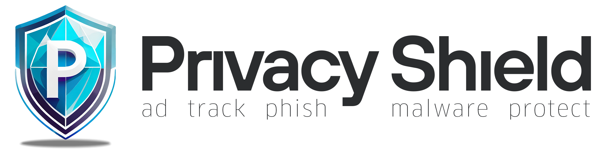

<!--- Logo -->

<div align="center">  
<picture>
  <source media="(prefers-color-scheme: dark)" srcset="./img/banner_dark.png" width="700vw">
  <source media="(prefers-color-scheme: light)" srcset="./img/banner_light.png" width="700vw">
  
</picture>
</div>
<br>

<!--- Badges -->

<div align="center"> 
  <a href="#" > 
    
  <a/>  
   <a href="https://github.com/Lennolium/PrivacyShield/branches" > 
    
    <a/>
   <a href="https://github.com/Lennolium/PrivacyShield/commits/master" > 
    
     <a/>
  <a href="https://github.com/Lennolium/PrivacyShield#download" > 
    
  <a/>   
     <br>
  <a href="https://github.com/Lennolium/PrivacyShield/issues" > 
    
  <a/>
  <a href="https://github.com/Lennolium/PrivacyShield/issues?q=is%3Aissue+is%3Aclosed" > 
    
  <a/>  
     <a href="https://tinyurl.com/opinionoffriends" > 
    
  <a/>
  <a href="https://github.com/Lennolium/PrivacyShield/blob/master/LICENSE" > 
    
  <a/>
</div>

<!--- Title Line -->

<div align="center">
  <h1></h1> 
</div>

<!--- Description -->

<div align="center">
A comprehensive AdGuard Filter List optimized for DNS level blocking of Ads, Analytics, Tracking, Malware &amp; Scam. Merged collection of lists from reputable sources. A full overview of all used source list can be found under "Included Lists". Request additional domains or report false-positives via <a href="https://github.com/Lennolium/PrivacyShield/issues">Issues</a> tab. <br><br>

[](https://www.paypal.me/smogg)
[](https://buymeacoffee.com/lennolium)
</div>
<div align="center">
  <h3></h3>  
    </div>     


<!--- Table of contents -->
    
## Table of contents

- [Features](#features)
- [Download](#download)
- [Installation](#installation)
  - [AdGuard Home](#adguard-home)
  - [AdGuard iOS](#adguard-ios)
  - [AdGuard Android](#adguard-android)
  - [Pi-Hole](#pi-hole)
  - [AdAway](#adaway)
- [Test Performance](#test-performance)
- [Included Lists](#included-lists)
- [Contributors](#contributors)
- [Development](#development)
- [Credits](#credits)
- [License](#license)

&nbsp;

<!--- Features -->
 
## Features
- __Optimized:__ The blocklists have 5 times fewer domains than all its aggregated and combined source lists, due to removed duplicates and junk.
- __Any device:__ Compatible with all devices which support AdGuard, regardless of OS.
- __Blockings:__ Strictly blocks `advertisements, analytics, malwares, ransomware, scam, spam, spyware, telemetry & trackers` and prevents your system from connecting to them.
- __Page load time:__ Quicker loading and cleaner looking web pages with fewer distractions.
- __Privacy:__ Helps to `increase privacy` by blocking online trackers.
- __Efficient:__ Lower resource waste (bandwidth, CPU, memory, battery etc.).
- __Well maintained:__ Domains are regularly updated and false-positives will be addressed quickly. Whitelist PrivacyGate already applied to all block lists.

&nbsp;

<!--- Download -->

## Download

| TITLE   | DESCRIPTION | FILE SIZE | DOMAIN COUNT | DOWNLOAD LINK   |
| --- | ---------------------- |:-------:|:--------------------------------------------------------------------------------------------------------------------------------:|:------------------------------------------------------------------------------------------------:|
| **Bronze/Mobile**  |  iOS/Android Version to use with app | 880K  | 44.811  |  [](https://raw.githubusercontent.com/Lennolium/PrivacyShield/master/Filters/PrivacyShield-bronze.txt)  |
| **Silver**  |  Very lightweight Protection  | 3M  | 160.363  |  [](https://raw.githubusercontent.com/Lennolium/PrivacyShield/master/Filters/PrivacyShield-silver.txt)  |
| **Gold**  |  Mid Range Protection  | 10M  | 493.554  |  [](https://raw.githubusercontent.com/Lennolium/PrivacyShield/master/Filters/PrivacyShield-gold.txt)  |
| **Platinum**  |  Balanced Protection  | 41M  | 1.866.567  |  [](https://raw.githubusercontent.com/Lennolium/PrivacyShield/master/Filters/PrivacyShield-platinum.txt)  |
| **Diamond**  |  Ultra High Protection (may breaks some sites)  | 52M  | 2.197.702  |  [](https://raw.githubusercontent.com/Lennolium/PrivacyShield/master/Filters/PrivacyShield-diamond.txt)  |
| **Antimatter**  |  Out of World Protection (may breaks sites)  | TBA  | TBA  |   [](#download)  |
| **Domains**  |  Domains-only variant of the Platinum filter list  | 36M  | 1.866.567  |  [](https://raw.githubusercontent.com/Lennolium/PrivacyShield/master/Filters/PrivacyShield-domains.txt)  |
| **White List**  |  White list applied to all filter lists  | 16M  | 645.414  |  [](https://raw.githubusercontent.com/Lennolium/PrivacyShield/master/Filters/PrivacyGate-whitelist.txt)  |

&nbsp; 
 
<!--- Installation -->

## Installation

Follow the instructions for your specific platform below to successfully implement the list.
For best performance I **recommend adding the white list** also to your AdGuard positive filters/whitelists. This ensures less false-positives, especially when using PrivacyShield in combination with other block lists.

>**Which Variant should I use?** 
>AdGuard, AdGuard Home, eBlocker, uBlock, AdBlock, AdBlock Plus, PiHole (FTL >= v5.22), Opera, Vivaldi, Brave, AdNauseam, Little Snitch Mini → Standard variant
>PiHole (FTL < v5.22), Blocky, Diversion (< v5), OpenSnitch, PersonalBlocklist, pfBlockerNG → Domains-only variant
>AdAway, uMatrix, DNS66, GasMask, NetGuard → Hosts variant

>For further assistance, you can [`Email me!`](mailto:info@lennolium.dev?subject=Question%20regarding%20PrivacyShield)

&nbsp; 
  
### AdGuard Home

1. Copy the link of the block list (DOWNLOAD LINK/raw) from the [Download](#download) section.
2. Filters
3. DNS Blocklists
4. Click "Add blocklist"
5. Click "Add a custom list"
6. Where it says: "Enter name" enter: "PrivacyShield" (without quotes)
7. Where it says: "Enter a URL or an absolute path of the list" paste the copied Link from Step 1.
8. Click "Save"
  
  
### AdGuard iOS

1. Copy the link of the block list (DOWNLOAD LINK/raw) from the [Download](#download) section.
2. Settings ("Cog"-icon in the bottom)
3. General
4. Enable "Advanced mode"
5. Go back to settings ("Cog"-icon in the bottom)
6. DNS Protection
7. Enable (if not already enabled)
8. Toggle OFF to ON
9. Tap OK then Allow to install a local VPN profile
10. DNS Filtering
11. DNS Filters
12. Add a filter
13. Where it says: "Enter a filter URL" paste the copied Link from Step 1.
14. Tap ADD
  
  
### AdGuard Android

1. Copy the link of the block list (DOWNLOAD LINK/raw) from the [Download](#download) section.
2. Settings
3. DNS Filtering
4. DNS requests blocking
5. PLUS NEW DNS FILTER
6. DNS Protection
7. Where it says: "URL or Path" paste the copied Link from Step 1.
8. Tap IMPORT
9. Where it says "Enter DNS Filter Name" enter "PrivacyShield" (without quotes)
10. Tap ADD
  
  
### Pi-Hole

1. Copy the link of the block list (DOWNLOAD LINK/raw) from the [Download](#download) section.
2. Settings
3. DNS Filtering
4. DNS requests blocking
5. PLUS NEW DNS FILTER
6. DNS Protection
7. Where it says: "URL or Path" paste the copied Link from Step 1.
8. Tap IMPORT
9. Where it says "Enter DNS Filter Name" enter "PrivacyShield" (without quotes)
10. Tap ADD
  
  
### AdAway

1. Copy the link of the block list (DOWNLOAD LINK/raw) from the [Download](#download) section.
2. Settings
3. DNS Filtering
4. DNS requests blocking
5. PLUS NEW DNS FILTER
6. DNS Protection
7. Where it says: "URL or Path" paste the copied Link from Step 1.
8. Tap IMPORT
9. Where it says "Enter DNS Filter Name" enter "PrivacyShield" (without quotes)
10. Tap ADD

&nbsp; 
 
<!--- Test Performance -->

## Test Performance

You can test if your ad blocker is working properly or not by running a check on these websites. A blocking rate starting of 70% is a good start:
       
[D3Ward](https://d3ward.github.io/toolz/adblock.html)       
[BlockAds!](https://blockads.fivefilters.org/)                       
 
&nbsp; 

<!--- Included Lists -->
 
## Included Lists

The List is gathered from many multiple, reputable sources, combined into one file, duplicates removed, validated, compressed and cleaned up. Furthermore false-positives and whitelisted domains are removed.

[Click here](https://github.com/Lennolium/PrivacyShield/blob/master/IncludedLists.md) for a complete overview.
  
&nbsp;

<!--- Development -->

## Development

As an open-source project, I strive for transparency and collaboration in my development process. I greatly 
appreciate any contributions members of our community can provide. Whether you are fixing bugs, proposing features, 
improving documentation, or spreading awareness - your involvement strengthens the project. Please review the 
[code of conduct](https://github.com/Lennolium/PrivacyShield/blob/master/.github/CODE_OF_CONDUCT.md) to understand how we work together 
respectfully.

- __Bug Report:__ If you are experiencing an issue while using the block list, please [create an issue](https://github.com/Lennolium/PrivacyShield/issues/new/choose).
- __Feature Request:__ Make this project better by [submitting a feature request](https://github.com/Lennolium/PrivacyShield/discussions/21).
- __Documentation:__ Improve our documentation by [adding a wiki page](https://github.com/Lennolium/PrivacyShield/wiki).
- __Community Support:__ Help others on [GitHub Discussions](https://github.com/Lennolium/PrivacyShield/discussions).
- __Security Report:__ Report critical security issues via our [template](https://github.com/Lennolium/PrivacyShield/blob/master/.github/SECURITY.md).

&nbsp;

<!-- Contributors -->

## Contributors

Thank you so much for giving feedback, implementing features and improving the code and project!

<a href = "https://github.com/Lennolium/PrivacyShield/graphs/contributors">
  
</a>

&nbsp;
  
<!--- Credits -->

## Credits

Full credit for the actual blocking ability goes to original list creators and maintainers. Thanks so much for your tireless work! Please notify me if I have violated a license condition.
     
&nbsp; 
 
<!--- License -->

## License

Provided under the terms of the [GNU GPL3 License](https://www.gnu.org/licenses/gpl-3.0.en.html) © Lennart Haack 2023.
 
For full Version see [License](https://github.com/Lennolium/PrivacyShield/blob/85c0d9ca98677b4db1be1c17d92562a8d5147331/LICENSE)!
 ```
 GNU GENERAL PUBLIC LICENSE
                       Version 3, 29 June 2007

 Copyright (C) 2007 Free Software Foundation, Inc. <https://fsf.org/>
 Everyone is permitted to copy and distribute verbatim copies
 of this license document, but changing it is not allowed.

                            Preamble

  The GNU General Public License is a free, copyleft license for
software and other kinds of works.

  The licenses for most software and other practical works are designed
to take away your freedom to share and change the works.  By contrast,
the GNU General Public License is intended to guarantee your freedom to
share and change all versions of a program--to make sure it remains free
software for all its users.  We, the Free Software Foundation, use the
GNU General Public License for most of our software; it applies also to
any other work released this way by its authors.  You can apply it to
your programs, too.
```
